---
filters:
  - "misc/inc_svg.lua"
---
# Introduction

<!-- ------------------------------------------------------------->

## Geometric intersection graphs

::: {.columns}

::: {.column width="40%"}
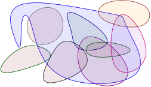{width="100%"}
:::

::: {.column width="60%"}
{data-autoplay="true" 
                           fig-align="center" loop="true" autoplay="true" muted="true"
                          width="100%"}
:::
:::

<!------------------------------------------------------------->

## Geometric intersection graphs {auto-animate=true}
### Definitely not planar

{.inc-svg num="001" w="45%" data-id="circles" }
{.inc-svg num="001" w="45%"    data-id="ngon"} 

<!------------------------------------------------------------->

## Geometric intersection graphs {auto-animate=true}
### ..but almost-planar in some cases

{.inc-svg num="001" w="47%" data-id="circles" }
{.inc-svg num="001" w="47%"    data-id="ngon"} 

<!------------------------------------------------------------->

## String graphs
### The ultimate intersection graphs
 

::: {style="text-align: center;"}
[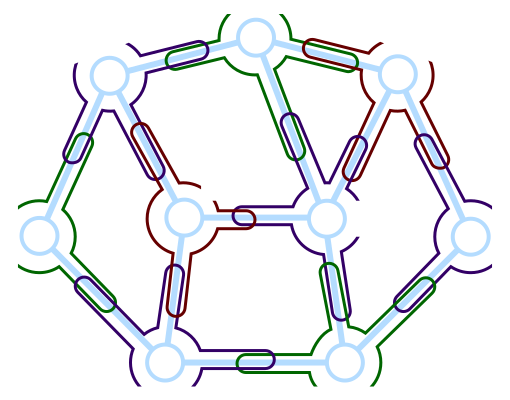]{style="background-color: white; display: inline-block; padding: 10px;"}
[Intersection graph of strings]{style="display: block; text-align: center;"}
:::

<!------------------------------------------------------------->
## Questions 

- What are these geometric intersection graphs?

   - What problems are efficiently solvable?
   - Which are NOT?

- What planar-graph like properties do they have?

<!------------------------------------------------------------->

## Open problem: Independent set


::: {.columns}

::: {.column width="30%"}
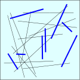{width="100%"}
:::

::: {.column width="70%"}
* *Problem:* Compute max size subset of segments not intersecting.

* [*QPTAS*](#def-QPTAS)$~$[@aw-asmwi-13]
           
* *Open question*: 
  * [PTAS]{title="Polynomial Time Approx Scheme"} for this problem?

  * constant-approx?

:::

::: 

<!------------------------------------------------------------>

# Independent set

* General graphs:
  No approximation within $n^{1-\eps}$,  $\forall \eps> 0$.

  [@h-cha-96]

* Intersection graph of strings: QPTAS.

  [@ahw-asiss-19]

* [@m-amisr-24]: $O(1)$-approx axis-aligned rectangles.

* **Meta question:** Why can do better in geometric settings?

<!-------------------------------------------------------->

##  Good and bad graphs
#### A computer scientist dream

* Planar graphs.

* Geometric intersection graphs.

* Low density graphs.

* Polynomial expansion graphs.

* *Bad graphs*:
  - Constant degree expanders.

  - Dense/complete graphs.

<!-------------------------------------------------->

## The bad news...

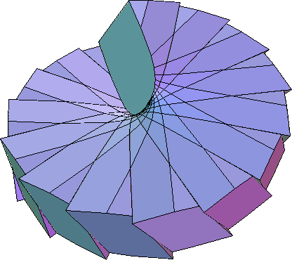{width="30%"}
$\qquad$
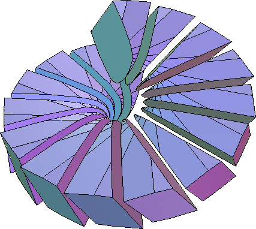{width="30%"}

* Everything is realizable in three dimensions.
 
* Any $3$-regular graph = intersection graph triangles in 3d.

* Must assume something additional.

* Figures from [@ek-alnfc-03].

# Planar graphs

## Planar graphs

::: {style="width: 450px; height: 200px; margin: auto; display: flex; align-items: center;"}
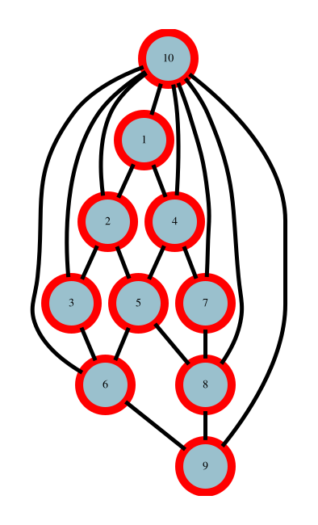{style="transform: rotate(90deg);" width="50%"}
:::

* Edges are Jordan arcs.

* [@f-slrpg-48]: Edges are straight segments.

* [@fpp-hdpgg-90]
  Edges segments + vertices in $\IntRange{2n}\times \IntRange{n}$ grid.

* [@k-kdka-36], [@a-ocpls-70]
  Circle packing theorem (Koebe-Andreev-Thurston theorem)

  Planar graphs = $\cap$-graphs of interior disjoint disks.

# Circle packing theorem

[]: ---------------------------------------------------

## Circle packing: Example I

{style="background-color: white;" width="30%" }
$\qquad$
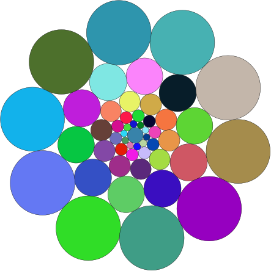{style="background-color: white;" width="30%" }

Figures drawn using Circle Packing software:

`http://w3.impa.br/~loustau/circlepackingsen.html`

## Circle packing: Example II

{style="background-color: white;" width="30%" }
$\qquad$
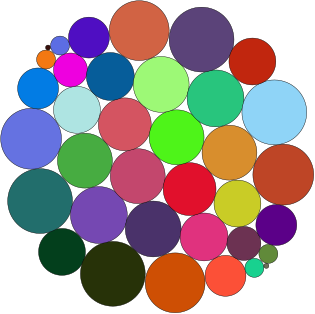{style="background-color: white;" width="30%" }

## Circle packing: Example III

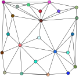{style="background-color: white;" width="30%" }
$\qquad$
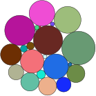{style="background-color: white;" width="30%" }

## Circle packing: Example IV
### Realization is not unique

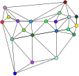{style="background-color: white;" width="30%" }
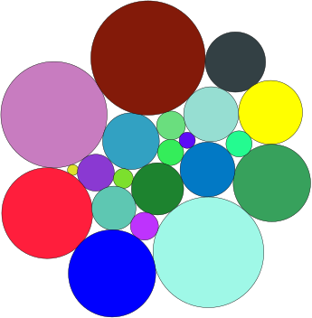{style="background-color: white;" width="30%" }
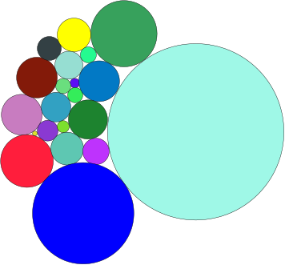{style="background-color: white;" width="30%" }

## Proof sketch: circle packing theorem

* Start with graph.

* Triangulate.

* Compute straight line embedding.

* Assign radii to vertices, arbitrarily.

## Example

{.inc-svg num="015" w="45%" data-id="Koebe" }

## Example 

{.inc-svg num="003" w="45%" data-id="Koebe" }

## Local triangles and local angles

{data-autoplay="true" 
                            fig-align="center" loop="true" autoplay="true" muted="true"
                            width="60%"}

## Proof sketch II: Circle packing

* Start with graph.

* Triangulate.

* Compute straight line embedding.

* Assign radii to vertices, arbitrarily.

* Yields a ``local'' triangulation.

* Game: By changing radii make all vertices locally planar.

* Sum of angles at a vertex $= 360^{\degree}$.

## Primal and dual

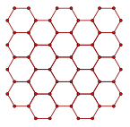{style="background-color: white;" width="40%" }
$\qquad$
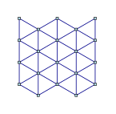{style="background-color: white;" width="40%" }

## Primal and dual as kissing disks

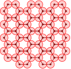{style="background-color: white;" width="40%" }
$\qquad$
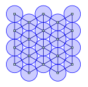{style="background-color: white;" width="40%" }

## Primal and dual as disks

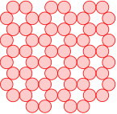{style="background-color: white;" width="40%" }
$\qquad$
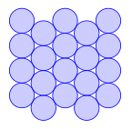{style="background-color: white;" width="40%" }

## Primal and dual: Overlay

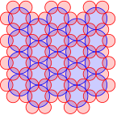{style="background-color: white;" width="40%" }
$\qquad$
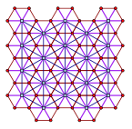{style="background-color: white;" width="40%" }

Circle packing theorem: Guarantees simultaneous representation for
      primal+dual graphs.

::: {.hidden}
{style="background-color: white;" width="40%" }
\newcommand{\PPGA}[2]{%
   \OnSlide{#1}{%
      \IncludeGraphics[width=0.45\linewidth,page=#2]%
      {figs/sep_real}%
   }%
}
:::

# Planar separator

## Planar separator from circle packing  {auto-animate=true}

{data-id="graph1" style="background-color: white;" width="60%" }

## Planar separator from circle packing  {auto-animate=true}

{data-id="graph1" style="background-color: white;" width="42%" }
$\qquad$
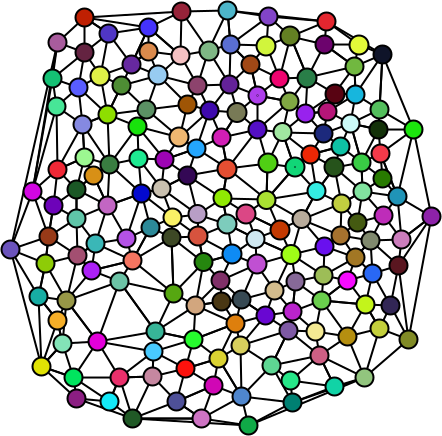{data-id="graph2" style="background-color: white;" width="42%" }

## Planar separator from circle packing  {auto-animate=true}

{data-id="graph2" style="background-color: white;" width="42%" }
$\qquad$
{data-id="srv1" style="background-color: white;" width="42%" }

## Planar separator from circle packing {auto-animate=true}

{data-id="srv1" style="background-color: white;" width="42%" }
$\qquad$
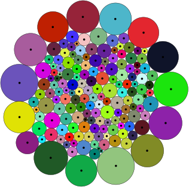{data-id="srv2" style="background-color: white;" width="42%" }

## Planar separator from circle packing {auto-animate=true}

{data-id="srv2" style="background-color: white;" width="42%" }
$\qquad$
{data-id="srv3" style="background-color: white;" width="42%" }

## Planar separator from circle packing  {auto-animate=true}

{data-id="srv2" style="background-color: white;" width="42%" }
$\qquad$
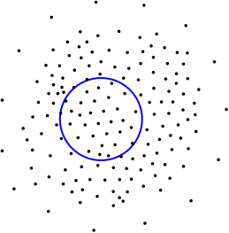{data-id="srv4" style="background-color: white;" width="42%" }

## Planar separator from circle packing {auto-animate=true}

{data-id="srv2" style="background-color: white;" width="42%" }
$\qquad$
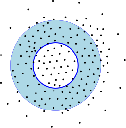{data-id="srv5" style="background-color: white;" width="42%" }

## Planar separator from circle packing {auto-animate=true}

{data-id="srv5" style="background-color: white;" width="42%" }
$\qquad$
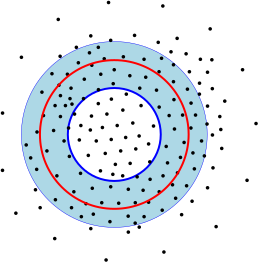{data-id="srv6" style="background-color: white;" width="42%" }

## Planar separator from circle packing {auto-animate=true}

{data-id="srv6" style="background-color: white;" width="42%" }
$\qquad$
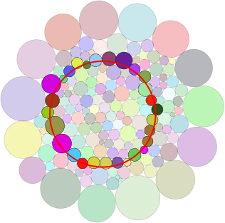{data-id="srv7" style="background-color: white;" width="42%" }

## Planar separator from circle packing {auto-animate=true}

{data-id="srv7" style="background-color: white;" width="42%" }
$\qquad$
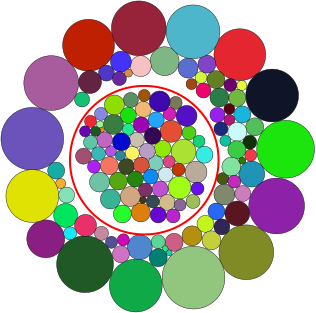{data-id="srv8" style="background-color: white;" width="42%" }

## Planar separator from circle packing {auto-animate=true}

::: {layout-nb-columns=2}

::: {.columns}

::: {.column width="45%"}
{data-id="srv7" style="background-color: white;" width="62%" }

{data-id="srv8" style="background-color: white;" width="62%" }
:::

::: {.column width="45%" style="background-color: white;"}
::: {.r-stack}
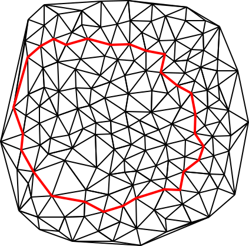{.fragment .fade-out fragment-index=1  width="72%" }

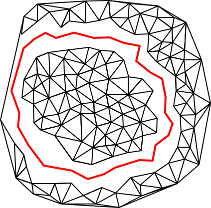{.fragment .fade-in  fragment-index=1  width="72%" }
:::
:::

:::

:::

## Planar separator from circle packing {auto-animate=true}

{data-id="srv8" style="background-color: white;" width="42%" }
$\qquad$
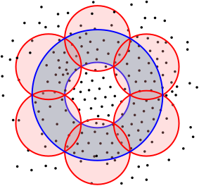{data-id="srv9" style="background-color: white;" width="42%" }

## Planar separator: Balanced? {auto-animate=true}

{data-id="srv9" style="background-color: white;" width="42%" }
$\qquad$
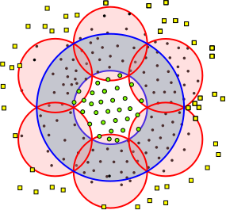{data-id="srv10" style="background-color: white;" width="42%" }

## Planar separator: Balanced? {auto-animate=true}

{data-id="srv10" style="background-color: white;" width="42%" }
$\qquad$
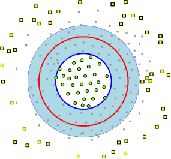{data-id="srv11" style="background-color: white;" width="42%" }

## Small separator: prob. intersection

{data-autoplay="true" 
                           fig-align="center" loop="true" autoplay="true" muted="true"
                          width="55%"}

## Small separator: Few vertices

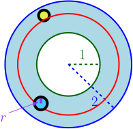{data-id="srv10" style="background-color: white;" width="22%" }

* Prob. disk intersect circle $2r/1 =2r$.
  ($r \approx 1/\sqrt{n}$).

* Expected \# small disks: $O(n (1/\sqrt{n})) = O(\sqrt{n})$.

* $\#$ large disks: $O(\sqrt{n})$.
 
  ... Large disk "occupies" $1/\sqrt{n}$ of length of circle.

## Circle packing/separator

* Circle packing theorem
[@t-frmt-85]: Constructing conformal mappings.

[@a-ocpls-70]: Observed by Thurston.

[@k-kdka-36]: A forgotten result.

* Planar separator theorem
       
* [@u-tpg-51]: $O(\sqrt{ n \log n})$.

* [@lt-stpg-79]: $O( \sqrt{n})$.
           
* [@mttv-sspnng-97]
  Geometric proof 

* [@m-fsscs-86]:
  Cycle separator (graph is triangulated)
           

## Natural questions

* Graphs represented as intersection graphs?

* Graph with small separators? 

* What can be solved efficiently?
   
# Low density graphs

## Low density objects {auto-animate=true}
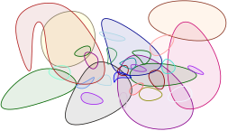{data-id="a" style="background-color: white;" width="42%" }

## Low density objects {auto-animate=true}
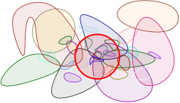{data-id="a" style="background-color: white;" width="42%" }

## Low density objects {auto-animate=true}
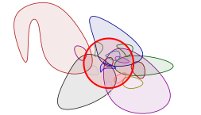{data-id="a" style="background-color: white;" width="42%" }

## Low density objects {auto-animate=true}
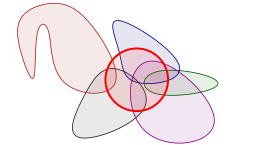{data-id="a" style="background-color: white;" width="42%" }

## Low density objects {auto-animate=true}

 {data-id="a" style="background-color: white;" width="32%" }

* $\ObjSet$: Objects in $\Re^d$ ($d=O(1)$),  $\ball$: ball.

* **density** of $\ball$ $=$ $\#$ ``larger'' objects in
       $\ObjSet$ that intersect $\ball$.

* $\cDensity =\densityX{\ObjSet}$: Max density of any ball.  

* If $\cDensity = O(1)$ $\implies$ $\ObjSet$ is **low density**.

[@sobv-mpelo-98], [@ss-empae-85]

## Low density set of objects

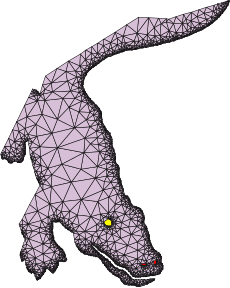{style="background-color: white;" width="30%"}
$\quad$
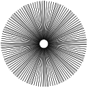{style="background-color: white;" width="40%"}

## Low density graphs

<!---- {.inc-svg num="001" w="45%" data-id="circles" } --->
{.inc-svg num="001" w="45%"}
$\quad$
{.inc-svg num="002" w="45%"}

::: {.callout-note icon=false}
### Definition: low density graph $\Graph$ 
       
 $\Graph$ realizable as intersection graph of set low density
objects $\subseteq \Re^d$.
:::

## Low-density graphs properties I

 {.inc-svg num="005" w="40%"} 
 $\quad${.inc-svg num="002" w="40%"}   

$\qquad$additive $\qquad\qquad\qquad\qquad$  degenerate

## Low-density graphs  properties II

{.inc-svg num="001" w="40%"} $\quad$ 
{.inc-svg num="005" w="40%"} 

$\qquad$ separable $\qquad\qquad$ arbitrarily large clique minors       

[]: -------------------------------------------------------------------

## Low density graphs: large minors {auto-animate=true}
#### Diamonds and rust

::: {style="position: relative;"}
{.inc-svg num="001" w="40%" data-id="a" }
:::

## Low density graphs: large minors {auto-animate=true}
#### Diamonds and rust

::: {style="position: relative;"}
{.inc-svg num="001" w="40%" data-id="a" }
{.inc-svg num="002" w="40%" data-id="b" }
:::

## Low density graphs: large minors {auto-animate=true}
#### Diamonds and rust

::: {style="position: relative;"}
{.inc-svg num="001" w="40%" data-id="a" }
{.inc-svg num="002" w="40%" data-id="b"
                     style="position: absolute; top: 0%; left: 0%; opacity: 0.5;"}
:::

## Low density graphs: large minors {auto-animate=true}
#### Diamonds and rust

::: {style="position: relative;"}
{.inc-svg num="003" w="40%" data-id="b"}
{.inc-svg num="004" w="40%" }
:::

<!--- this is a comment -->
## Low density graphs: large minors {auto-animate=true}
#### Diamonds and rust

::: {style="position: relative;"}
{.inc-svg num="004" w="40%"}
{.inc-svg num="005" w="40%" }
:::

<!--- this is a comment -->
## Low density graphs: large minors {auto-animate=true}
#### Diamonds and rust

::: {style="position: relative;"}
{.inc-svg num="005" w="40%"}
{.inc-svg num="006" w="40%" }
:::

## $t$-clusters 

{.inc-svg num="014" w="60%"}

::: {.callout-note icon=false}
### Definition: $t$-cluster 

Subgraph $\GraphA$ of $\Graph$ is a **$t$-cluster** if
$\mathrm{radius}(\GraphA) \leq t$.
:::

<!--------------------------------------------------------------------->

## $t$-clusters and $t$-shallow minors

{.inc-svg num="002" w="60%"}

$\Family$: Disjoint set of $t$-clusters of $\Graph$. 

<!--------------------------------------------------------------------->

## $t$-clusters and $t$-shallow minors

{.inc-svg num="003" w="60%"}

$\Family$: Disjoint set of $t$-clusters of $\Graph$. 

<!--------------------------------------------------------------------->

## $t$-shallow minors

{.inc-svg num="004" w="60%"}

$\Family$: Disjoint set of $t$-clusters of $\Graph$. 

::: {.callout-note icon=false}
### Definition: $t$-shallow minor 
$\GraphB$: **$t$-shallow minor** of $\Graph$ $\iff$
intersection graph of disjoint $t$-clusters of $\Graph$.
:::

<!--------------------------------------------------------------------->

## $t$-shallow minors and growth rate

{.inc-svg num="004" w="60%"}

::: {.callout-note icon=false}
### Definition: $t$-shallow minor 
$\GraphB$: **$t$-shallow minor** of $\Graph$ $\iff$
intersection graph of disjoint $t$-clusters of $\Graph$.
:::

**Growth rate** of $\Graph$: $\displaystyle f(t) = \max_{\GraphB \in
\triangledown_t(\Graph) }\frac{\cardin{\Edges \pth{{\GraphB}}}}
{\cardin{\Vertices \pth{\GraphB}}}$

<!--------------------------------------------------------------------->

## Growth by example {auto-animate=true}

::: {.columns}

::: {.column width="40%"}
{.inc-svg num="001" w="100%"}
:::
::: {.column width="50%"}
Two layers of the 3d grid.

$n=128$: vertices

$m=288$: edges

$D=4.5$: Avg Deg
:::
:::

## Growth by example {auto-animate=true}

::: {.columns}

::: {.column width="40%"}
{.inc-svg num="001" w="70%"}

$n=128$: vertices

$m=288$: edges

$D=4.5$: Avg Deg

:::

::: {.column width="40%"}
{.inc-svg num="001" w="80%"}
:::

::: {.column width="20%"}

radius $= 2$

$n=64$

$m=168$

$D=5.25$
:::

:::

## Growth by example {auto-animate=true}

::: {.columns}

::: {.column width="40%"}
{.inc-svg num="001" w="70%"}

$n=128$: vertices

$m=288$: edges

$D=4.5$: Avg Deg

:::

::: {.column width="40%"}
{.inc-svg num="001" w="80%"}
:::

::: {.column width="20%"}

radius $= 3$

$n=48$

$m=138$

$D=5.75$
:::

:::

## Growth by example {auto-animate=true}

::: {.columns}
::: {.column width="40%"}
{.inc-svg num="001" w="70%"}

$n=128$: vertices

$m=288$: edges

$D=4.5$: Avg Deg
:::
::: {.column width="40%"}
{.inc-svg num="001" w="80%"}
:::
::: {.column width="20%"}
radius $= 4$

$n=32$

$m=108$

$D=6.75$
:::
:::

## Growth by example {auto-animate=true}

::: {.columns}
::: {.column width="40%"}
{.inc-svg num="001" w="70%"}

$n=128$: vertices

$m=288$: edges

$D=4.5$: Avg Deg
:::
::: {.column width="40%"}
{.inc-svg num="001" w="80%"}
:::
::: {.column width="20%"}

radius $= 8$

$n=16$

$m=78$

$D=9.75$
:::
:::

## Growth by example {auto-animate=true}

| $t$: radius  | $n$   | $m$   | Avg-Deg              | $\approx f(t)$ |
|---------|-------|-------|---------------------:|---------------:|
| $1$     | $128$ | $288$ | $4.5$                | $2.25$         |
| $2$     | $64$  | $168$ | $5.25$               | $2.625$        |
| $3$     | $48$  | $138$ | $5.75$               | $2.875$        |
| $4$     | $32$  | $108$ | $6.75$               | $3.375$        |
| $8$     | $16$  |  $78$ |  $9.75$              | $4.374$        |

## Growth rate of different graphs

* Planar graphs: $f(t) = O(1)$.

* Constant degree expanders: $f(t) = 2^{O(t)}$.

* Low density graph ($\cDensity$: density. Induced by objects in
  $\Re^d$).

  $f(t) = t^{O(d)} \cDensity$.
  [@hq-aapel-15]

* **Polynomial expansion** graphs: $f(t) = t^{O(1)}$.

  Introduced by [@no-gcbe1-08].

  Low density graphs $\subseteq$ polynomial expansion graphs.
       
   

## Sparse graphs
#### Systematic study of sparse graph classes.
 
Jaroslav Nešetřil, Patrice Ossona de Mendez
 
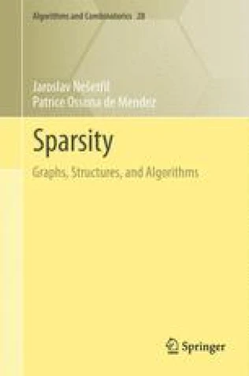

## Some sparse graph classes

::: {.columns}
::: {.column width="50%"}
* Trees.

* Planar graphs.
       
* Bounded genus.
       
* Excluded minor.
       
* Bounded tree width.
       
* **Low density**.

* **Polynomial expansion**
:::

::: {.column width="50%"}

       
* Constant degree expanders.
       
* Bounded expansion.
       
* Locally bounded tree width/locally bounded expansion.

* Nowhere dense graphs.
:::

:::

## Polynomial expansion = $\exists$ separator

**Theorem [@no-gcbe1-08]** 

$\Graph$ has polynomial expansion

$\implies$
$\Graph$ has hereditary separator of size $O(n^c)$, for $c < 1$

 

**Theorem [@dn-ssspe-15]** 

$\Graph$ has hereditary separator of size $O(n^c)$, for $c < 1$

$\implies$
$\Graph$ has polynomial expansion.

# Approximation algorithms  polynomial-expansion graphs

## Check if there is a good exchange 
### For independent set

::: {.columns}

$L$: Current local solution

::: {.column width="40%"}
$G$: Graph

$X$: Set to change
:::

::: {.column width="60%"}
**isGoodExchange**( $\locSet$, $X$, $b$ )
:    **if**  $\cardin{X} > b$ $\qquad\implies$ **return** $0$
:    **if** $\cardin{\locSet \oplus X} \leq \cardin{\locSet}$ $\implies$ **return** $0$
:    **if** $\locSet \oplus X$ is independent in $G$
:    $\quad$**return** $1$
:    **else**
:    $\quad$**return** $0$
:::

:::

## Independent set via local search

$S$: Set of $n$ objects

**compIndepSet**$\pth{ \ObjSet, b}$
:    $\locSet \Leftarrow \{ \}$
:    **while** $\exists$ good exchange
: $\qquad$    **for** $X\subseteq \ObjSet$: $|X|=b$
: $\qquad\qquad$         **if** **isGoodExchange**$(\locSet, X, b)$ 
:  $\qquad\qquad\qquad$ $\locSet \Leftarrow \locSet \oplus X$
:     <!----->
 
: **return** $L$

**Question:**
For what graphs the above is a PTAS?
   

<!----------------------------------------------------------------------------->
<!----------------------------------------------------------------------------->
## Separators and divisions {auto-animate=true}

{.inc-svg num="001" w="50%"}

<!----------------------------------------------------------------------------->
<!----------------------------------------------------------------------------->
## Separators and divisions {auto-animate=true}

{.inc-svg num="002" w="50%"}

Recursive application of separators

<!----------------------------------------------------------------------------->
<!----------------------------------------------------------------------------->

## Separators and divisions {auto-animate=true}

{.inc-svg num="003" w="40%"}

Break graph into patches of size $b= 1/\eps^{O(1)}$.

$\#$ boundary vertices in patch: Sublinear in $b$.

<!----------------------------------------------------------------------------- -->
## Separators and divisions {auto-animate=true}

::: {.columns}

::: {.column width="40%"}
{.inc-svg num="004" w="80%"}
:::

::: {.column width="60%"}
* **$b$-divisions**: [@hkrs-fspap-97]
           
* Planar graphs: \# boundary vertices for cluster
           $O(\sqrt{b})$.
           
  [@f-faspp-87]
:::

:::

## Example: Local search for graphs  {auto-animate=true}

::: {.columns}
::: {.column width="70%"}
{.inc-svg num="001" w="80%" data-id="ii"}
:::

::: {.column width="20%"}

:::
:::

## Example: Local search for graphs  {auto-animate=true}

::: {.columns}
::: {.column width="40%"}
{.inc-svg num="002" w="100%" data-id="ii"}
:::

::: {.column width="60%"}
- [$42$]{style="color: red;"}: Size of opt solution
:::

:::

<!--------------------------------------------------------------->
## Example: Local search for graphs  {auto-animate=true}

::: {.columns}
::: {.column width="40%"}
{.inc-svg num="003" w="100%" data-id="ii"}
:::

::: {.column width="60%"}
- [$42$]{style="color: red;"}: Size of opt solution
- [$38$]{style="color: blue;"}: Size of local solution
:::

:::

<!--------------------------------------------------------------->
## Example: Local search for graphs  {auto-animate=true}

::: {.columns}
::: {.column width="40%"}
{.inc-svg num="004" w="100%" data-id="ii"}
:::

::: {.column width="60%"}
- [$42$]{style="color: red;"}: Size of opt solution
- [$38$]{style="color: blue;"}: Size of local solution
- Graph induced on $L \cup O$
:::

:::

<!--------------------------------------------------------------->
## Example: Local search for graphs  {auto-animate=true}

::: {.columns}
::: {.column width="40%"}
{.inc-svg num="005" w="100%" data-id="ii"}
:::

::: {.column width="60%"}
- [$42$]{style="color: red;"}: Size of opt solution
- [$38$]{style="color: blue;"}: Size of local solution
- Graph induced on $L \cup O$
- Matching solutions
:::

:::

<!--------------------------------------------------------------->
## Example: Local search for graphs  {auto-animate=true}

::: {.columns}
::: {.column width="30%"}
{.inc-svg num="006" w="100%" data-id="ii"}
:::

::: {.column width="70%"}
- [$42$]{style="color: red;"}: Size of opt solution
- [$38$]{style="color: blue;"}: Size of local solution
- Graph induced on $L \cup O$
- Matching solutions
- Compute $b$-division with $\eps \text{opt}$ $\partial$vertices
:::

:::

<!--------------------------------------------------------------->
## Example: Local search for graphs  {auto-animate=true}

::: {.columns}
::: {.column width="30%"}
{.inc-svg num="007" w="100%" data-id="ii"}
:::

::: {.column width="70%"}
- [$42$]{style="color: red;"}: Size of opt solution
- [$38$]{style="color: blue;"}: Size of local solution
- Graph induced on $L \cup O$
- Matching solutions
- Compute $b$-division with $\eps \text{opt}$ $\partial$vertices
- Break into clusters by removing $\partial$vertices.

:::

:::

<!--------------------------------------------------------------->
## Example: Local search for graphs  {auto-animate=true}

::: {.columns}
::: {.column width="25%"}
{.inc-svg num="008" w="100%" data-id="ii"}
:::

::: {.column width="75%"}
- [$42$]{style="color: red;"}: Size of opt solution
- [$38$]{style="color: blue;"}: Size of local solution
- Graph induced on $L \cup O$
- Matching solutions
- Compute $b$-division with $\eps \text{opt}$ $\partial$vertices
- Break into clusters by removing $\partial$vertices.
- If $L$ too small $\implies$ $\exists$ good exchange.

:::

:::

## Example: Local search for graphs  {auto-animate=true}

::: {.columns}

::: {.column width="85%"}
- [$42$]{style="color: red;"}: Size of opt solution
- [$38$]{style="color: blue;"}: Size of local solution
- Graph induced on $L \cup O$
- Matching solutions
- Compute $b$-division with $\eps \text{opt}$ $\partial$vertices
- Break into clusters by removing $\partial$vertices.
- If $L$ too small $\implies$ $\exists$ good exchange.

- Every cluster must be roughly balanced.
           
- $\cardin{L} \geq (1-\eps) \cardin{\text{opt}}$.  

:::

::: {.column width="15%"}
{.inc-svg num="008" w="100%" data-id="ii"}
:::

:::

## Example: Local search for graphs  {auto-animate=true}

::: {.columns}

::: {.column width="85%"}
           
- $\cardin{L} \geq (1-\eps) \cardin{\text{opt}}$.  

- [@mr-pghsp-09]: PTAS for hitting set of disks.

- [@ch-aamis-09]: PTAS for independent set of disks

:::

::: {.column width="15%"}
{.inc-svg num="008" w="100%" data-id="ii"}
:::

:::

# String graphs

## Interesting results on string graphs

- A string graph with $m$ edges $\exists$ separator 
  of size $O( \sqrt{m } )$
  [@l-srig-16]

- There are examples where string graphs **require** exponential number of crossings.
  [@m-sgs-14].
 
- String graphs have the Erdős–Hajnal property

  Either there is a clique of size $\Omega(n)$ or independent set of size $\Omega(n)$.
  
  [@i-sgehp-23]
  

## Even more results on string graphs

- $O(1)$-Distortion Planar Emulators for String Graphs

  [@cctz-dpesg-25].

# Thesis

## Thesis

* low density graphs = Geometric intersection graphs of low density objects.

* **Polynomial expansion** and **low density**:
  interesting classes.

* Efficient algorithms for planar/low-genus graphs should be
  extendable to these classes.

* Fertile ground for further research.

## Open problems

* Combinatorial algorithm realizing planar graph as intersection graph
       of low density objects?

* recognition?
       
* Better understanding sparse graphs (nowhere dense graphs, etc).

* Combinatorial algorithm for circle packing like result?

* Can low density graphs be realized by a set of objects?

* Overlay of road maps.
       
  * Metrics?  Approximation algorithms? Distance oracles?
       

## The end...

{.inc-svg num="001" w="100%" data-id="ff"}

# Relevant references

# Refs

* Low density of a set of objects was defined by [@sobv-mpelo-98].

* Low density graphs are discussed in detail in [@hq-aapel-15].

  Somewhat similar definitions can be found in earlier work, see for
  example [@mttv-gsfem-98].

## Refs: Separators
       
  * The separator proof as shown is from [@h-speps-13].

  * Adapted for low density graphs in [@hq-aapel-15].

  * Both of the above are readily implied from known results:
    [@mttv-sspnng-97], [@sw-gsta-98], and
    [@c-ptasp-03].

  * For technically interesting separator result for the intersection
    graph of strings, see [@m-sgs-13].

## Refs on circle packing

* Lovasz has a nice monograph describing circle-packing and other
       geometric representation of graphs [@l-grg-09].

  http://www.cs.elte.hu/~lovasz/geomrep.pdf

* Circle packing is nicely described by [@s-icptd-05].

* One can approximate circle packing in polynomial time,
  but the drawing is not quite in the plane. [@m-ptcpa-93].

## Refs for circle packing II

* The numbers involved in circle packings are awful
  [@bdeg-gcgd-15]. There are some cases where things are nicer, but
  the graphs are significantly more restricted
  [@aegkp-bcppg-14].

* Oded Schramm had some interesting extensions, from
       \emph{``How to cage an egg''} [@s-hce-92], to
       \emphi{``monster packing theorem''} [@s-cppac-90].
   

## Refs on software

* Almost all figures in this slides were generated using ipe.

  [`http://ipe.otfried.org/`](http://ipe.otfried.org/).

* The circle packing realizations were drawn using the
  following software (which was hacked to use the cairo library):

   ``http://w3.impa.br/~loustau/circlepackingsen.html``

* This version of the slides was created using quarto

   `https://quarto.org/`

[]: -------------------------------------------------------------

# Definitions

## QPTAS {#def-QPTAS}

* QPTAS
  * Quasi-polynomial time approximation scheme. 

  * Running time is $2^{(\frac{1}{\eps}\log n)^{O(1)}}$

  * Solution size: $\geq (1-\eps)\mathrm{OPT}$

* PTAS
  * Polynomial approximation scheme. 
  * Running time is $n^{f(\eps)}$

  * Solution size: $\geq (1-\eps)\mathrm{OPT}$

* Constant approx

# Bibliography

## References {style="height: 100%; overflow-y: scroll;"}

::: {#refs}
:::

<!----------------------------------------------------------------------------------->
